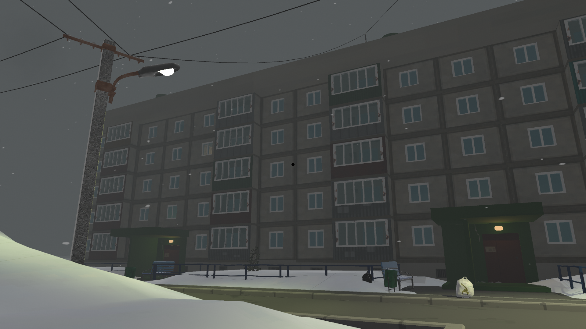
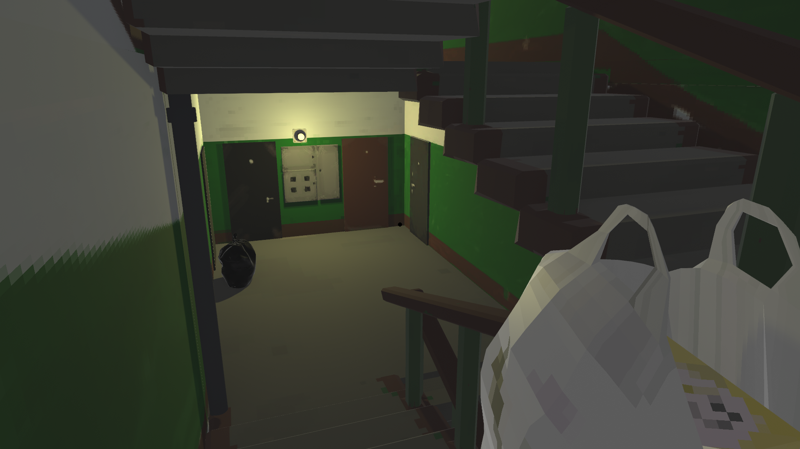
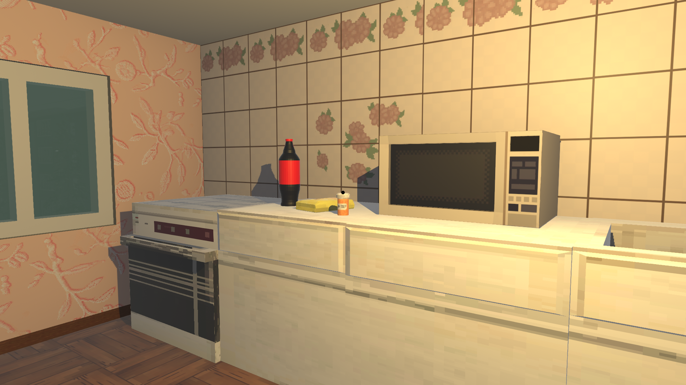
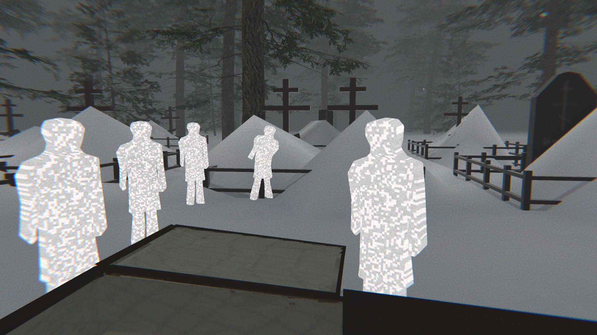

# 🎮 Smutek

Smutek is an indie demo that immerses players in the atmosphere of post-Soviet realities. Explore gray streets, encounter the slow rhythm of everyday life, strange meetings, and hidden melancholy. Combining exploration, interactive storytelling, and quiet philosophy, the game invites reflection on memory, loss, and small joys in a world that has long lost its vibrant colors.
Licenses and copyright for the project:

- Code and Scenes: GPL v3 — original code and scenes belong to VlanH.
- Music: Created using Suno AI Free Plan — non-commercial use only, rights belong to Suno AI.
- Images: Collaborative work by VlanH, animrok, and фишкобирлик.
- Sounds: CC0 / Public Domain sounds, and original sounds by VlanH (attribution required).
- Unity Assets: the following assets from Unity Asset Store are used. All rights belong to the asset authors:

    1. **Conifers (BoTD)** — Author: Ben B.  
       [Asset Store link](https://assetstore.unity.com/packages/3d/vegetation/trees/conifers-botd-142076)

    2. **Chair and Armchair** — Author: Pro Assets  
       [Asset Store link](https://assetstore.unity.com/packages/3d/props/furniture/chair-and-armchair-26360)

This README clarifies the authorship of all components.

# 🎮 Smutek
Smutek — инди-демо, погружающее игрока в атмосферу постсоветских реалий. Исследуйте серые улицы, сталкивайтесь с тягучей рутиной, странными встречами и скрытой меланхолией повседневной жизни. Игра сочетает в себе элементы исследования, интерактивного повествования и тихой философии, заставляя задуматься о памяти, потерях и маленьких радостях в мире, который давно потерял яркие краски.

Лицензии и авторские права проекта:

- Код и сцены: GPL v3 — оригинальный код и сцены принадлежат VlanH.
- Музыка: Создана с помощью Suno AI Free Plan — только некоммерческое использование, права принадлежат Suno AI.
- Изображения: совместное авторство VlanH, animrok и фишкобирлик.
- Звуки: CC0 / Public Domain и собственные звуки VlanH (требуется указание авторства).

- Ассеты Unity: использованы следующие ассеты из Unity Asset Store. Все права принадлежат авторам ассетов:

    1. **Conifers (BoTD)** — автор: Ben B.  
       [Ссылка на Asset Store](https://assetstore.unity.com/packages/3d/vegetation/trees/conifers-botd-142076)

    2. **Chair and Armchair** — автор: Pro Assets  
       [Ссылка на Asset Store](https://assetstore.unity.com/packages/3d/props/furniture/chair-and-armchair-26360)

## 📸 Screenshots
<table>
  <tr>
    <td align="center">
      
       
      <b>🏙️ Post-Soviet Streets Постсоветские улицы</b>
    </td>
    <td align="center">
      
       
      <b>🏘️ Entrance of a Soviet house Подъезд Постсоветские дома</b>
    </td>
  </tr>
  <tr>
    <td align="center">
      
       
      <b>🏠 Kitchen Кухня</b>
    </td>
    <td align="center">
      
       
      <b>👥 Funeral Похороны </b>
    </td>
  </tr>
</table>

Этот README разъясняет авторство всех компонентов проекта.

