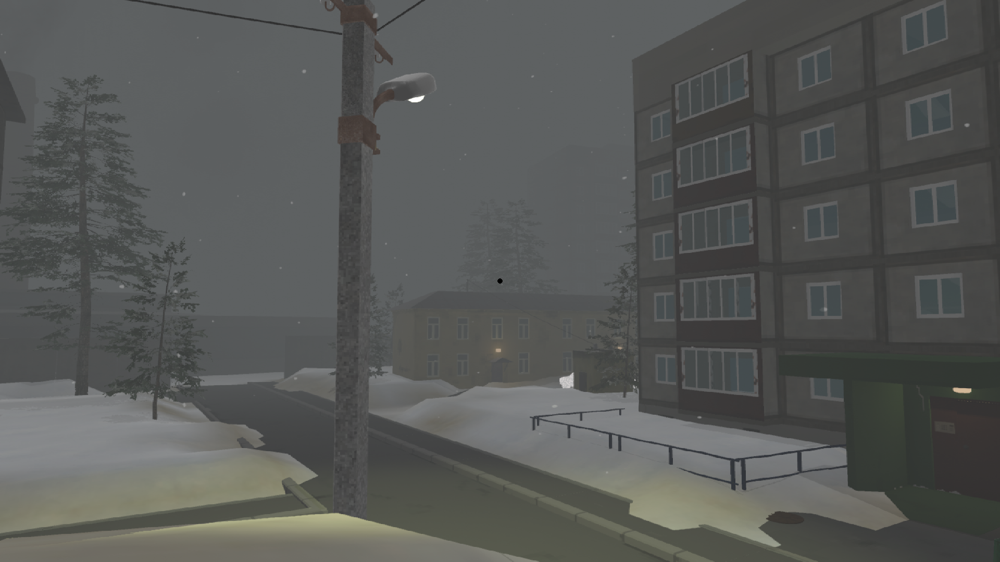
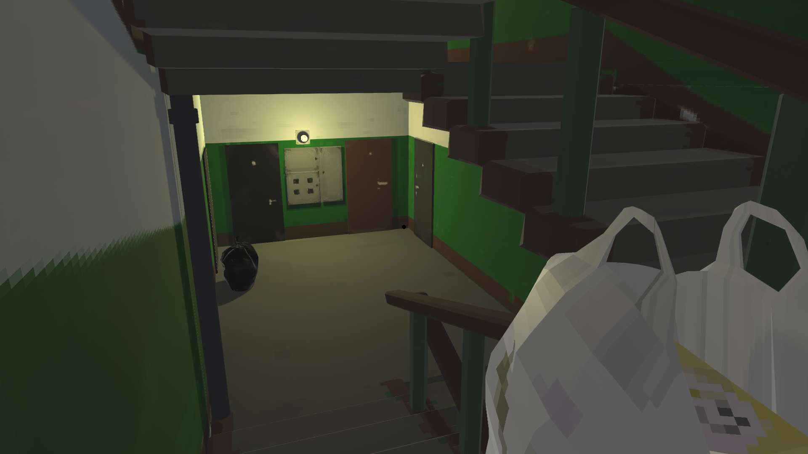
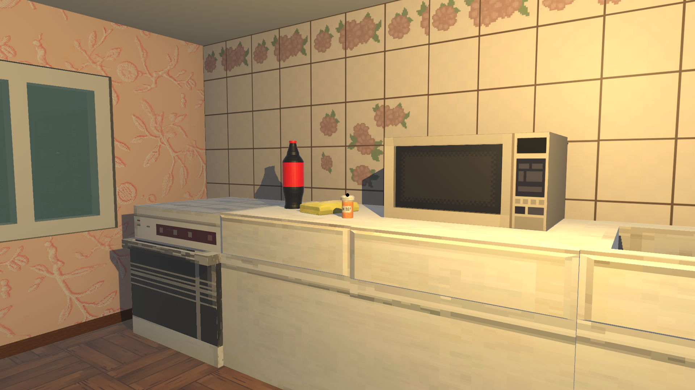
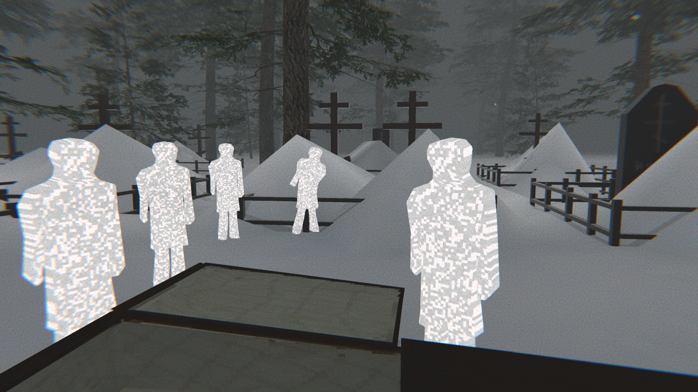

# 🎮 Smutek

## 📖 About the Project

**Smutek** is an indie demo immersing players in the atmosphere of post-Soviet realities.
Explore gray streets, face the slow rhythm of everyday life, encounter strange meetings, and feel the hidden melancholy behind ordinary routines.

Blending **exploration**, **interactive storytelling**, and **quiet philosophy**, the game reflects on **memory, loss, and small joys** in a world that has long lost its vibrant colors.

---

## 🚀 Quick Start

1. Download the latest build for your platform:

   * [⬇ Linux](https://github.com/VlaanH/Smutek/releases/download/Release_0.2/LInux64.tar.gz)
   * [⬇ Windows](https://github.com/VlaanH/Smutek/releases/download/Release_0.2/WIN64.zip)

2. Unpack the archive.

3. Run the executable and start exploring.

---

## 📜 Licenses & Credits

* **Code & Scenes**: GPL v3 — original by **VlanH**.
* **Music**: Created with *Suno AI Free Plan* — non-commercial use only, rights belong to Suno AI.
* **Images**: Collaborative work of **VlanH**, **animrok**, and **фишкобирлик**.
* **Sounds**: CC0 / Public Domain, plus original sounds by **VlanH** (*attribution required*).
* **Unity Assets**:

  1. [Conifers (BoTD)](https://assetstore.unity.com/packages/3d/vegetation/trees/conifers-botd-142076) — Author: *Ben B.*
  2. [Chair and Armchair](https://assetstore.unity.com/packages/3d/props/furniture/chair-and-armchair-26360) — Author: *Pro Assets*

---

## 📸 Screenshots

<table>
  <tr>
    <td align="center">
      
       
      <b>🏙️ Post-Soviet Streets Постсоветские улицы</b>
    </td>
    <td align="center">
      
       
      <b>🏘️ Soviet Courtyard Entrance Подъезд советского дома</b>
    </td>
  </tr>
  <tr>
    <td align="center">
      
       
      <b>🏠 Kitchen Кухня</b>
    </td>
    <td align="center">
      
       
      <b>👥 Funeral Похороны</b>
    </td>
  </tr>
</table>

---

## 🇷🇺 О проекте

**Smutek** — инди-демо, погружающее игрока в атмосферу постсоветских реалий.
Исследуйте серые улицы, сталкивайтесь с тягучей рутиной, странными встречами и скрытой меланхолией.

Игра сочетает в себе **исследование**, **интерактивное повествование** и **тихую философию**, заставляя задуматься о **памяти, потерях и маленьких радостях** в мире, где давно погасли яркие краски.

---

## 📜 Лицензии и авторство

* **Код и сцены**: GPL v3 — оригинал от **VlanH**.
* **Музыка**: создана с помощью *Suno AI Free Plan* — только некоммерческое использование, права принадлежат Suno AI.
* **Изображения**: совместная работа **VlanH**, **animrok** и **фишкобирлик**.
* **Звуки**: CC0 / Public Domain и оригинальные звуки **VlanH** (*необходимо указание авторства*).
* **Ассеты Unity**:

  1. [Conifers (BoTD)](https://assetstore.unity.com/packages/3d/vegetation/trees/conifers-botd-142076) — автор *Ben B.*
  2. [Chair and Armchair](https://assetstore.unity.com/packages/3d/props/furniture/chair-and-armchair-26360) — автор *Pro Assets*

---

